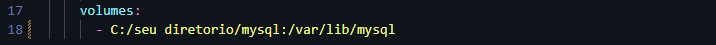
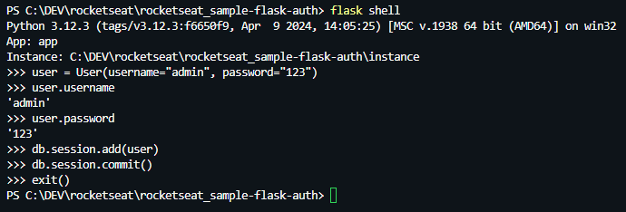

# API para controle de dieta diária, a Daily Diet API.
Autenticação de usuários utilizando Python, MySQL, SQLAlchemy, Docker e Postman.
- Editar uma refeição, podendo alterar todos os dados acima
- Apagar uma refeição
- Listar todas as refeições de um usuário
- Visualizar uma única refeição

## Instalação
Considerando que você já tenha o Python e o Docker instalados em seu sistema, execute os passos para a execução do app.

1. Clone o repositório para sua máquina local:
```bash
git clone https://github.com/narcelllo/rocketseat_sample-flask-auth.git
```
2. Navegue até a pasta do projeto e execute:
```bash
pip install -r requirements.txt
```
Todas as dependências serão instaladas com base no arquivo `requirements.txt` existente neste repositório

## Docker
1. Em `docker-compose.yml` adicione seu diretório MySQL para consistir seus dados:
 
  

2. Execute o comando:
```bash
docker-compose up
```
## Criando banco de dados
1. Em seu terminal acesse o flask shell: 

```bash
flask shell
```
```bash
db.crate_all()
```
```bash
exit()
```
## Execução do app
1. Você pode usar o `flask shell`:
   - Exemplo

   
2. Postman:
  1. Import a collection `Authentication API.postman_collection.json` e  environment `Authentication local.postman_environment.json` presentes neste repositório em seu Postman.

## Requisitos
- Python 3.12.3
- Flask 3.0.3
- Flask-SQLAlchemy 3.1.1
- Flask-Login 0.6.3
- Werkzeug 3.0.3
- Cryptography 43.0.0
- Bcrypt 4.2.0
- Pymysql 1.1.1
- DateTime 5.5.0

## OBS:
Desafio referente ao módulo: Desenvolvimento Avançado com Flask formação Rocketseat.
